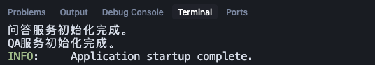
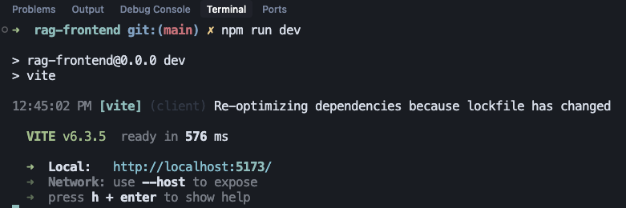
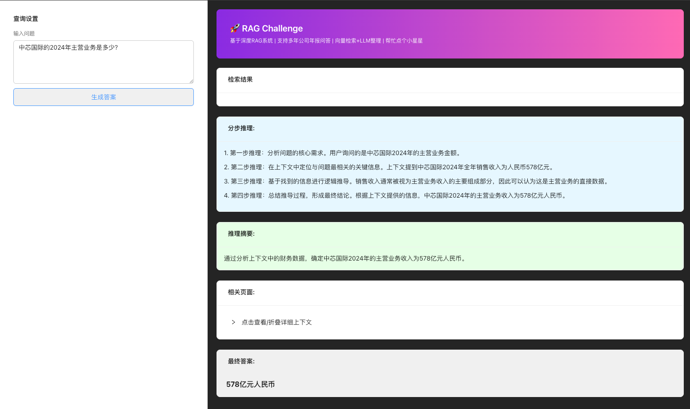
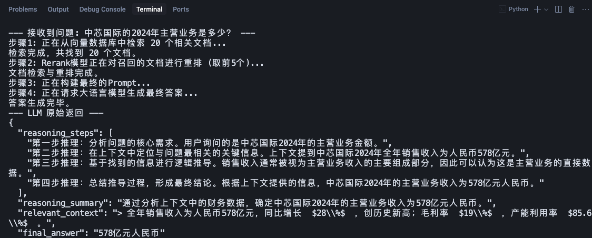

# Like it? Give it a star! ⭐ | 好用点个星！⭐
# RAG 企业知识库问答应用

本项目是一个基于RAG（检索增强生成）架构的全栈问答应用，旨在通过与本地知识库（如PDF研报）的交互，为用户提供精准、可靠的答案。项目后端采用Python和FastAPI构建，前端则由React和Tailwind CSS驱动。

## ✨ 功能特性

- **PDF 内容解析**: 自动解析PDF文件，提取文本和表格内容。
- **向量化知识库**: 使用通义千问Embedding模型将文档向量化，并存储在ChromaDB中。
- **灵活的RAG流程**: 实现"检索->（可选）重排->生成"的RAG流程。重排（Rerank）步骤可配置，允许在不同模型和性能需求间灵活切换。
- **意图识别**: 可根据问题类型（如普通问答、SWOT分析）动态调整输出格式（文本或JSON）。
- **Web API服务**: 基于FastAPI提供高性能的后端API接口。
- **现代化前端**: 基于React和Vite构建，使用Tailwind CSS实现美观的交互界面。

## 🛠️ 技术栈

- **前端**
  - **React**：构建现代化的响应式用户界面
  - **Ant Design (antd)**：企业级UI组件库，提升界面美观与交互体验
  - **Vite**：极速前端开发与构建工具，支持热更新和高效打包

- **后端**
  - **Python**：后端主力开发语言
  - **FastAPI**：高性能Web API框架，负责API接口开发与服务
  - **LangChain**：大模型与知识库的中间件，负责文档分块、RAG流程编排、与向量数据库集成
  - **ChromaDB**：本地化高性能向量数据库，支持知识库的向量化存储与高效相似度检索

- **AI与知识增强**
  - **minerU API**：用于PDF文档的结构化解析，自动提取文本和表格内容
  - **通义千问 DashScope API**：
    - **text-embedding-v2**：用于将文档和问题转化为向量，实现高效语义检索
    - **gte-rerank-v2**：用于对召回的文档进行相关性重排序，提升检索精度
    - **大语言模型（如 qwen-turbo）**：用于自然语言生成最终答案

- **其他**
  - **Node.js & npm**：前端依赖管理与开发环境
  - **Vite**：前端开发与构建工具

## 🔧 系统环境要求

- **Python**: 3.10+
- **Node.js**: 18.18.0+
- **通义千问API Key**: 您需要一个有效的阿里云Dashscope API密钥。
- **minerU API Key**: 您需要一个有效的 minerU API 密钥用于PDF解析。

## 🚀 快速启动

按照以下步骤在您的本地环境中启动并运行本项目。

### 1. 克隆仓库

```bash
git clone https://github.com/your-username/your-repo-name.git
cd your-repo-name
```

### 2. 后端配置与启动

#### a. 安装依赖

建议使用虚拟环境。

```bash
# 创建虚拟环境
python -m venv venv

# 激活虚拟环境 (macOS/Linux)
source venv/bin/activate
# (Windows)
# venv\Scripts\activate

# 安装Python依赖
pip install -r requirements.txt
```

#### b. 配置API密钥与模型

项目已忽略`config.py`以保护您的密钥。请通过模板文件进行配置。

```bash
# 复制模板文件
cp config.py.template config.py
```
然后，打开 `config.py` 文件，完成以下配置：
1.  **通义千问API密钥**: 将 `"YOUR_API_KEY"` 替换为您自己的真实阿里云Dashscope API密钥。
2.  **minerU API密钥**: 将 `"YOUR_MINERU_API_KEY"` 替换为您的真实minerU API密钥。这是PDF解析功能所必需的。
3.  **模型选择 (可选)**: 您可以根据需求调整模型。
    *   `GENERATION_MODEL_NAME`: 用于生成最终答案的大语言模型，如 `'qwen-plus'` 或 `'qwen-turbo'`。
    *   `RERANK_MODEL_NAME`: 用于对检索结果进行精细排序的模型，如 `'gte-rerank-v2'`。如果生成模型不适合或不需要重排，此步骤会被智能跳过。

#### c. 准备知识库数据

这是最关键的一步，您需要用自己的数据来填充知识库。

**① 放置PDF文件 (如何换数据)**
将您想要作为知识库来源的 **所有PDF文件** 放入 `data/raw_reports/` 目录下。您可以先清空该目录下的示例文件。

**② 解析PDF文件**
运行PDF解析脚本，将PDF转换为结构化的JSON文件。

```bash
python core/pdf_parser.py
```
处理完成后，您会在 `data/processed/` 目录下看到生成的JSON文件。

**③ 创建向量数据库**
运行知识库管理脚本，将JSON文件向量化并存入数据库。

```bash
python core/knowledge_base_manager.py
```
处理完成后，您会在项目根目录下看到一个 `vector_store/` 文件夹，这就是您的知识库。

#### d. 启动后端服务

```bash
python main.py
```
服务启动后，会监听 `http://localhost:8000`。您可以访问 `http://localhost:8000/docs` 查看自动生成的API文档。



### 3. 前端启动

打开 **一个新的终端**，执行以下命令：

```bash
# 进入前端项目目录
cd rag-frontend

# 安装前端依赖
npm install

# 启动前端开发服务器
npm run dev
```
服务启动后，终端会显示一个本地网址，通常是 `http://localhost:5173`。



### 4. 访问应用

在您的浏览器中打开前端服务的网址 (如 `http://localhost:5173`)，即可开始使用。




---

## 🧾 许可证与商业使用
本项目采用 **AGPL-3.0 许可证**，这意味着：
- 您可以自由地使用、修改和分发本项目，但必须遵守 AGPL-3.0 协议要求
- **闭源商用需要购买商业授权**
- 项目的**重要贡献者**可免费获得商业授权

> ℹ️ 我们强烈建议优先考虑AGPL-3.0合规方案。如有商业授权疑问，请邮件联系作者